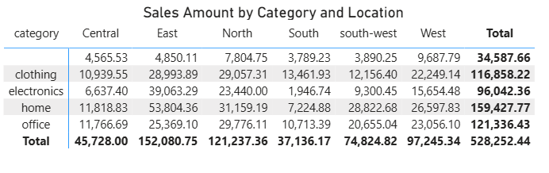
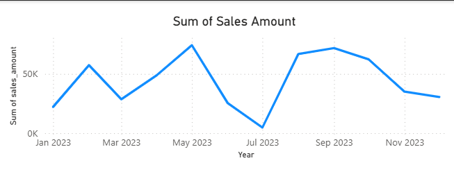
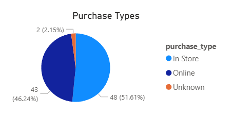
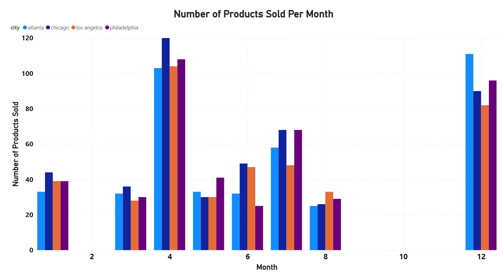
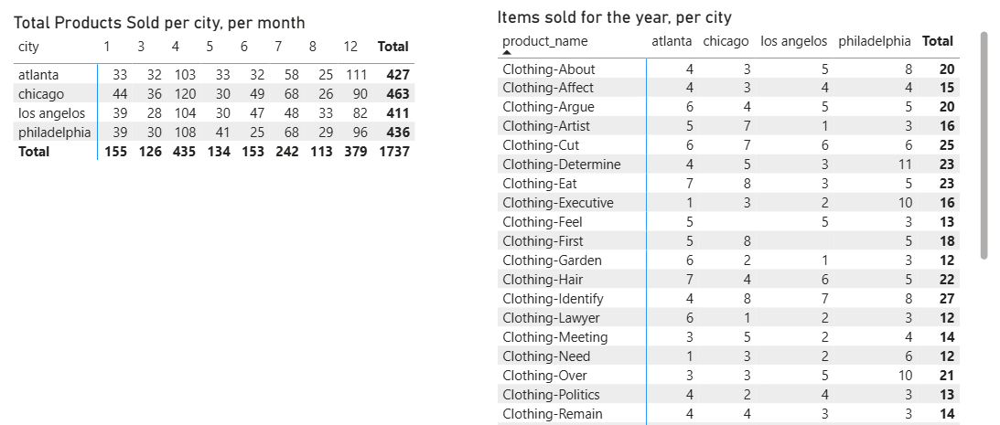
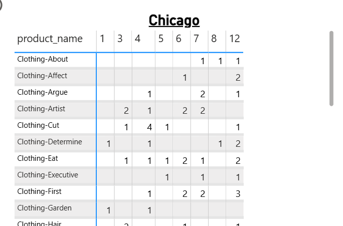
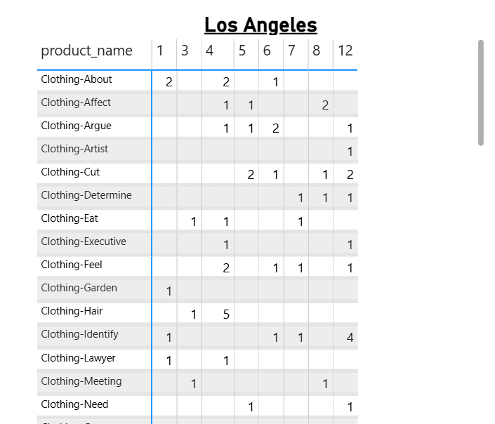
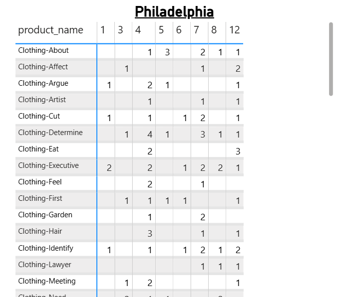
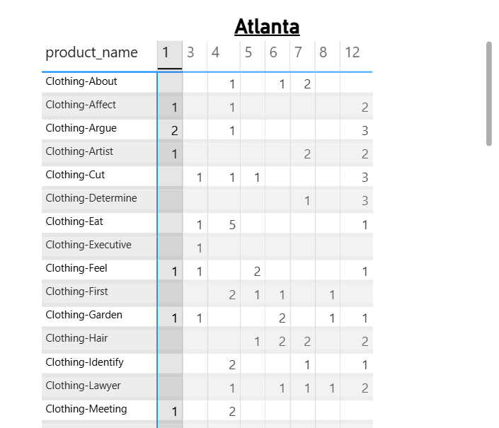

## WORKFLOW 1. Set Up Your Machine

Followed the correct steps to set up machine. Most of it was already set up from projects in a previous class.

## WORKFLOW 2. Set Up Your Project

After verifying your machine is set up, set up a new Python project by copying this template.
Complete each step in the following guide.

- [SET UP PROJECT](./SET_UP_PROJECT.md)

It includes the critical commands to set up your local environment (and activate it):

```shell
uv venv
uv python pin 3.12
uv sync --extra dev --extra docs --upgrade
uv run pre-commit install
uv run python --version
```

**Windows (PowerShell):**

```shell
.\.venv\Scripts\activate
```

## 3 Check your Setup/Machine

## 3.2 Run Checks as You Work


1. Update dependencies (for security and compatibility).
2. Clean unused cached packages to free space.
3. Use `git add .` to stage all changes.
4. Run ruff and fix minor issues.
5. Update pre-commit periodically.
6. Run pre-commit quality checks on all code files (**twice if needed**, the first pass may fix things).
7. Run tests.

In VS Code, open your repository, then open a terminal (Terminal / New Terminal) and run the following commands one at a time to check the code.

```shell
uv sync --extra dev --extra docs --upgrade
uv cache clean
git add .
uvx ruff check --fix
uvx pre-commit autoupdate
uv run pre-commit run --all-files
git add .
uv run pytest
```

NOTE: The second `git add .` ensures any automatic fixes made by Ruff or pre-commit are included before testing or committing.

<details>
<summary>Click to see a note on best practices</summary>

`uvx` runs the latest version of a tool in an isolated cache, outside the virtual environment.
This keeps the project light and simple, but behavior can change when the tool updates.
For fully reproducible results, or when you need to use the local `.venv`, use `uv run` instead.

</details>

## 3.3 Build Project Documentation

Make sure you have current doc dependencies, then build your docs, fix any errors, and serve them locally to test.


## 3.4 Execute

This project includes demo code.
Run the demo Python modules to confirm everything is working.

In VS Code terminal, run:

```shell
uv run python -m analytics_project.demo_module_basics
uv run python -m analytics_project.demo_module_languages
uv run python -m analytics_project.demo_module_stats
uv run python -m analytics_project.demo_module_viz
```

You should see:

- Log messages in the terminal
- Greetings in several languages
- Simple statistics
- A chart window open (close the chart window to continue).

If this works, your project is ready! If not, check:

- Are you in the right folder? (All terminal commands are to be run from the root project folder.)
- Did you run the full `uv sync --extra dev --extra docs --upgrade` command?
- Are there any error messages? (ask for help with the exact error)

---

## 3.5 Git add-commit-push to GitHub

Anytime we make working changes to code is a good time to git add-commit-push to GitHub.

1. Stage your changes with git add.
2. Commit your changes with a useful message in quotes.
3. Push your work to GitHub.

```shell
git add .
git commit -m "describe your change in quotes"
git push -u origin main
```

This will trigger the GitHub Actions workflow and publish your documentation via GitHub Pages.

## 3.6 Modify and Debug

With a working version safe in GitHub, start making changes to the code.

Before starting a new session, remember to do a `git pull` and keep your tools updated.

Each time forward progress is made, remember to git add-commit-push.

## 4 Add Raw Data

I added the raw data in csv files.

## 5 Add to the data

I added errors to the data so that I could practice fixing them.

## 6 Prepare the data

I followed the format for preparing the data.

## 7 Pre-Load Data Preparation

I used the utils_scrubber.py to clean the data. I decided to make three additional python scripts in order to do this because I didn't want to erase work that I had already completed. I also wanted to be able to compare the two processes and I will be better able to do that if I have the original document to look over. The new files all have _scrub in them so that you can tell the difference.

I tried to pay close attention to the dtypes of each column so that they would be all set for data analysis.

I also went ahead and changed the names to meet SQL standards.

## 8 ETL to Databse

Organization
1) The sales data table is the primary key and the customer and product tables are the foreign table.
2) All numbers are integers except for sale amounts and prices, since they are money amounts and should be rounded to two decimal places.
3) All dates follow the d/m/y format.

Problems Encountered
1) I needed to still use sys and pathlib because my data folder is in a sub folder, and not where it should be. I need to look into file paths and re-learn that since it didn't stick from my first class.
2) AFter updating the path I created the tables and uploaded the data.
3) I kept receiving errors saying that there were duplicates in my table, when there shouldn't have been because of the pre-cleaning work that I did. This means there is either an error in my utils_scrubber.py file or in both of the files prep_customer_scrub.py and prep_sales_scrub.py.
4) I used AI to change my code so that it removed duplicates as it loaded the database.

## 9 Creating Visualizations

I used Power BI to create visuals for the database. I focused mainly on sales data by date. Sadly, my sale date data was not accurate. So I used the joined date. In the real world I would not do this. I would go back to the original, raw data and complete the entire process again to have correct data. But since this is a class and the point was to learn the visuals, I decided to just work with the data that I had in the current database.

### 9a:Initial Data and Slicing
We started by creating a new table of how much clients spent to identify our top clients. I created a bar graph showing how much our top clients spent and then added on a slicer so that it could be sorted by year.



### 9b: Dicing
I then created a matrix so that you could view the amount of sales sorted by an item's category and the location it was bought in. This would help a company identify trends across the country and per region.


### 9c: Drilldow
I made a line graph showing the amount of sales over time. This would allow a company to match up sales trends with possible explanations. For example, they could line up a drop in prices with a minor recession in the country. They could identify the timelines of different promotions and see if they lined up with any increase in sales.



### 9d: Sales type visualization
The last step I did was to create a pie chart visualizing the types of sales, in store or online, to allow the business to know where they are getting the most of their revenue from and to help guide them in their future decisions about promotions.




## 10: OLAP Project Design

### Section 1: The Business Goal:
The goal is to use the sales in each city, per month, to determine the stock each city needs. This is important because having too much stock of products that aren’t selling will make the city branch lose money, but not having enough stock in a city may cause the business to lose customers, and therefore revenue.

### Section 2: Data Source
I started with a pre-computed cube. I took the product names from the products table, and the sales amount, sale date, and city name from the sales table. The product ID served as the key between the two tables. I then found the sum of the sales by product and by city to then find the average amount of sales per month.

### Section 3: Tools
I used vs code to create my precube and then Power BI to create my visualizations. I chose to create a precube to get more practice with coding, and I chose to make my visualizations with Power BI because I want to explore its capabilities more.

### Section 4: Workflow & Logic
Description dimension: product name, city,
Numeric metric: Sales amount, product ID,
Aggregations: Sum, average
Slicing: by city
Dicing: by sales and product
Drilldown: from year to month

While I included the sales amount, it was really for curiosity's sake and was not used in the results or suggested action plan. I wanted to break the sales down by item and city so that each city store would know how much of each item the should have in stock based on last year's sales.

### Section 5: Results
I created two overview pages, so that you could look at sales for the whole company. I created a bar graph to gain understandings about the trends in sales for the whole company and per city. I created a matrix that could break down the sales per item for the whole company.





Then I broke it down by city. Each city/store got a different tab with its own matrix that showed them how much of each product they would need each month.









### Section 6: Suggested Business Action
I would suggest that the business use their sales from the previous year to determine their stock for the current year. Based on the bar graph, their busiest months were in April and Decemeber. Stores should expect more sales during those months and possibly be ready with a little extra stock. They could purchase more stock than needed in April, hoping to increase their sales at an already high sales time, knowing they should have another busy month in December in which they can sell anything they overbought.

What items sold in each store, especially during the different months, was varied. It would be better to do store specific promotions to reach specific customers as opposed to a company wide promotion. Company wide promotions would be hit or miss per store because their customer base varies per store. Whereas store specific promotions should equally reach all stores.

Stores should look at possible promotions in the other months, but especially in August, to get more customers into the store. August had the least amount of sales for almost every store.

### Section 7: Challenges
I struggled with creating the correct pathways to the folders and files. I had to use code in debug_code_file_path.md to figure out where the code was trying to pull dataframe from, and change my pathways to match it.
