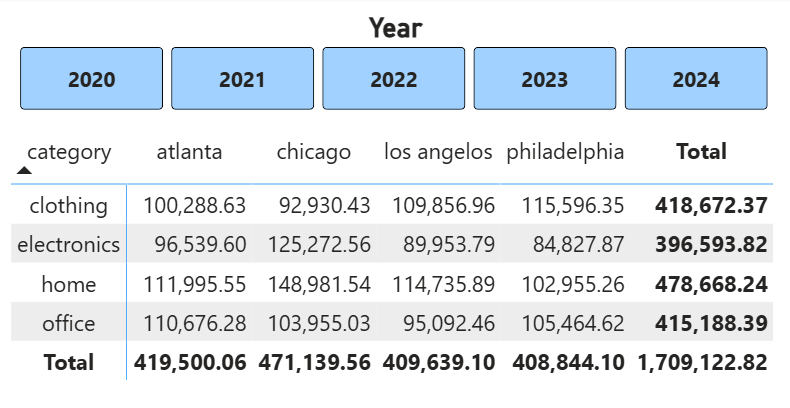

# Project 7
In Module 7, we bring everything together by creating a custom BI decision support project that reflects real-world business intelligence challenges. We define a specific business goal, build a BI solution using the skills and tools from previous modules, and present our insights effectively.

We explore the role of AI and data ethics in business intelligence, addressing how automated decision-making and data-driven insights must align with ethical principles and business goals.

This short module is intended to consolidate learning and prepare us for independent BI work.

All scripts mentioned are in the project_7 folder unless directly stated otherwise.

All data is in the data_p7 sub folder unless directly stated otherwise.

## 1. The Business Goal
We are focusing on previous customers and how to increase revenue from them. Our goal is to decide which location has the most customers, which location has more recent customers, determine what these customers buy, and how much they spend in order to create promotions that will encourage our loyalty members to purchase items from our store more frequently.

## 2. Data Source
The original data source is from Denise Case: https://github.com/denisecase/smart-sales-raw-data/tree/main/data/raw
It was initially cleaned and prepared for projects earlier in this module. It resides in the folders for the other projects.

     smart-store2-kehummel
        ├── src
        │   └── data
        │       └── prepared
        |           ├──customers_prepared.csv
        |           ├── products_prepared.csv
        |           └── sales_prepared.csv

## 3. Tools Used
I used python through vscode to clean the data and create a data cube. I used Power BI to create my visuals and help create my analysis.

## 4. Workflow & Logic

### Preparing Data
First, I wanted to make sure the data was ready for the analysis I was about to complete. I made sure money amounts went to two decimal places, that dates were formatted correctly, and that all other numbers were set as integers.

I also made sure all duplicates were removed, because that was a problem I had with a previous module; not all duplicates had actually been removed so I made sure to fix it and remove all duplicates this time.

I removed all accounts that had 0 purchase amounts because our goal is to increase purchases made by pervious customers, not plan earn new customers.

Completed scripts are:
    scrub_customers.py
    scrub_products.py
    scrub_sales.py

Completed csvs are:
    sales_cube_prep.csv
    products_cube_prep.csv
    customer_cube_prep.csv

### Creating Cube
I wanted to have the data joined altogether systematically so I decided to make a multidimensional cube so that it would be easy to load my data in Power BI.

I joined the columns needed. I created extra columns to have the year of when the customers joined and to have how long it had been since each customer joined to see how customers acted over time.

I aggregated the category, city, year, customer_id, sales amount, days since joined, and time since joined.

Completed Script: create_cube_p7

Output: ps_cube.csv

### Visuals & Analyzing Data
I loaded my cube into Power BI and used charts and graphs to dissect the data more. This not only gave me the ability to narrow down my analysis, but it also provided me with visuals that I could use to show my analysis.

## 5. Results (narrative + visualizations)
I used the data from the cube and visual representations to break down which city had the best and worst sales per category.I create two bar graphs, two line graphs, and a matrix.

This allowed me to see that from 2000 to 2023, all category of sales had increased. It also showed me that from 2000 to 2023 sales in Atlanta, Chicago, and Philadelphia increased. For Los Angeles, sales increased from 2000 to 2022. In 2024 all sales in all cities and categories drastically decreased, which signals that there is either a problem with the data or an external factor out of the individual stores' control. For instance, this could be an incomplete data set for 2024, which would indicated a problem with the data. Otherwise I would look for an external factor or something going on within the company. If there was an economic recession, that could account for the drop in sales. Or if the company suffered from a PR mismanagement that might also account for the drop in sales.

Then I looked at the highest selling category and lowest selling category for each city and found:
Atlanta - Highest grossing category = home goods
        Lowest grossing category = electronics
____________________________________________________________________________
Chicago - Highest grossing category = home goods
        Lowest grossing category = clothing
____________________________________________________________________________
Los Angeles - Highest grossing category = home good
            Lowest grossing category = electronics
____________________________________________________________________________
Philadelphia - Highest grossing category = clothing
            Lowest grossing category = electronics

## 6. Suggested Business Action
Based on this information there are 2 suggestions for increasing revenue. The first one focuses on the stated business goal. The second one focuses on interesting data found during the analysis.

### Business Action 1
The goal being to increase repeat customers, the company should focus on what their customers already bought at the store and and get them back for those same categories. Either, each store could focus on their highest grossing category and send out discounts or highlighted deals to the previous customers specifically or they could create an ad campaign for the highest grossing category and push it out to all media outlets to try to bring in new customers as well. If the company wanted to push out something company wide instead of specific to each store, they should focus on promotions for home goods because for 3 out of 4 of the stores home goods was the highest grossing category. And even though it wasn't the highest grossing category for Philadelphia, it still grossed over $100,000

### Business Action 2
3 out of the 4 stores had electronics and their lowest grossing category. This means it is the category with the biggest potential for growth. As you look more closely at the electronics data, you can see that in Chicago, it was the second highest grossing category, earning over $20,000 over office goods and over 30,000 over clothing. Chicago's electrics sales also beat out every other city's electronics sales by at least $25,000.

I would suggest a study on Chicago's store and their electronics department, their sales, and what caused those higher sales. I would survey customers who bought electronics at that store and use all of that data to come up with a promotion and ad campaigns for the other stores' electronic departments. Chicago's electronics department is an outlier that should be investigated to see if its success can be replicated.

## 7. Challenges
There were two main things that I struggled with. The first one was creating the multidimensional data cube. I didn't want to turn my data from csv format to database format to cube format. I wanted to go straight from csv to cube. To do that I needed new code and couldn't use/adapt what we had previously used in class. I spent a long time thinking through what the code would need to look like and whether or not I could adjust the code from previous projects or needed to start new. It took a long time to wrap my brain around how it needed to look.

The second challenge I had was keeping myself focused while analyzing the data. While looking at the data and creating tables and graphs, I would notice different things and want to explore them or think about all of the different suggestions I could make to business. I had to really focus myself and continually ask myself if what I was looking at was going to help me answer the business goal or not.

## 8. Ethical Considerations
The company needs to be careful that they do not breech their customers' data privacy. In this data set we had their first and last name. There wasn't any other personal information but if they are able to send out promotions then the company does have more personal information from their customers and they need to be mindful of this and make sure it is secure.

This is analysis had lots of human oversight. I made the decision for every step of the process. However I can see how it would be easy to just run data through a code and run with it instead checking through it.
